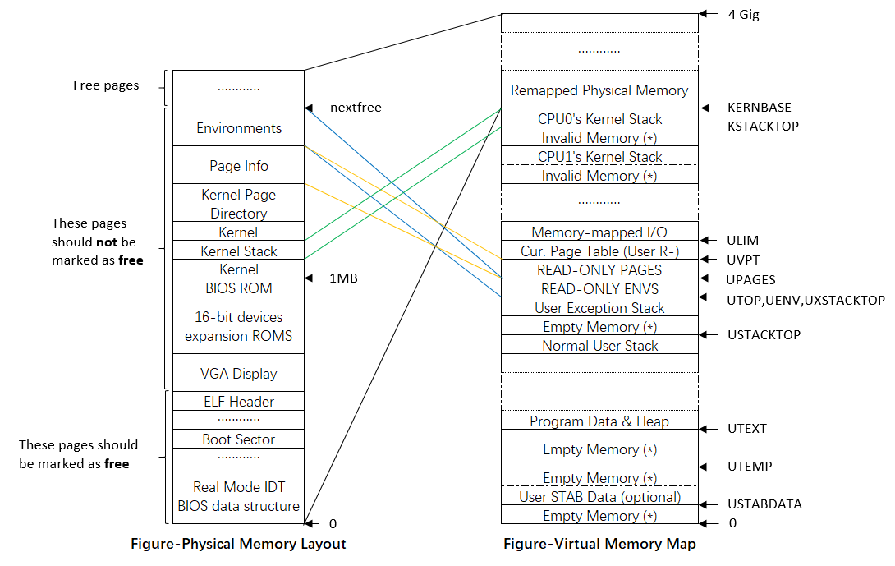
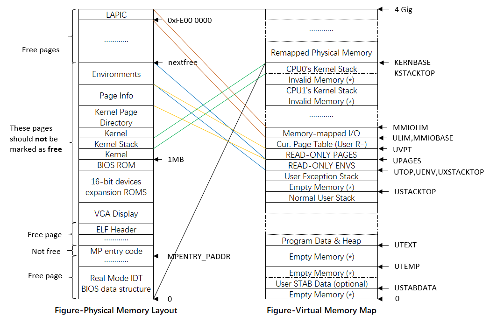
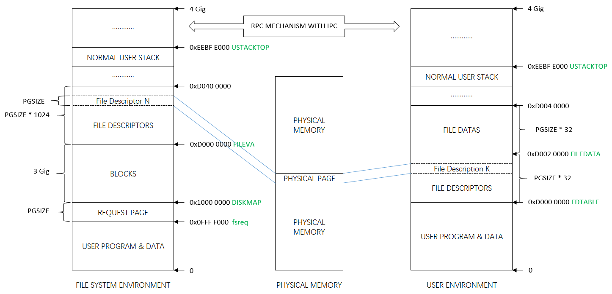
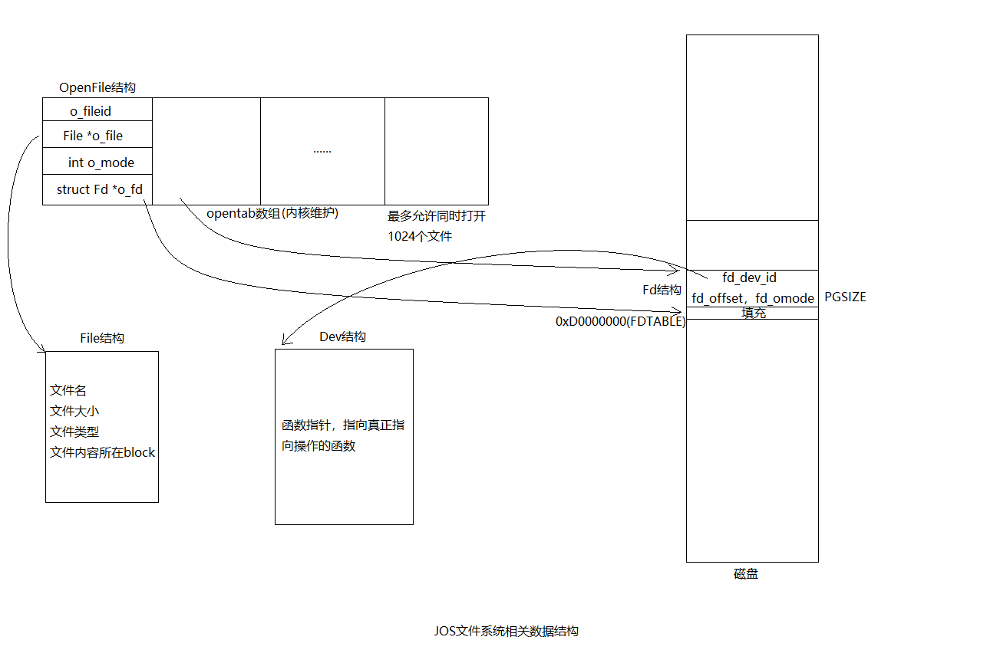

### MIT6.828 JOS实验

#### 参考资料
1. [xv6 中文文档](https://th0ar.gitbooks.io/xv6-chinese/)
1. [XV6 | ProfessorDeng](https://professordeng.com/xv6/resources)，基于[xv6-public，rev11](https://github.com/mit-pdos/xv6-public)的源码
1. [2020年的实验（基于risc-v）](https://pdos.csail.mit.edu/6.828/2020/schedule.html)
  * [博客园/掘金博客](https://github.com/weijunji/xv6-6.S081)
1. [2018年的实验](https://pdos.csail.mit.edu/6.828/2018/schedule.html)
  * [MIT6.828-神级OS课程](https://github.com/SmallPond/MIT6.828_OS)，作者的[博客](https://www.dingmos.com/category/MIT6-828/)
  * [MIT-6.828-OSE - YanTang Qin的博客](https://qinstaunch.github.io/categories/%E6%93%8D%E4%BD%9C%E7%B3%BB%E7%BB%9F/MIT-6-828-OSE/)
  * [博客园 - Gatsby123](https://www.cnblogs.com/gatsby123/p/12075572.html)
1. [2016年的实验](https://pdos.csail.mit.edu/6.828/2016/schedule.html)
  * [CSDN - bysui的博客](https://blog.csdn.net/bysui/category_6232831.html)，完成了全部的实验
  * [bdhmwz - 博客园](https://www.cnblogs.com/bdhmwz/)
  * [CSDN - Xv6操作系统](https://blog.csdn.net/woxiaohahaa/category_9265735.html)
  
#### 2018年的实验
1. [Caffeinated 6.828：实验工具指南](https://linux.cn/article-10273-1.html)
1. [Caffeinated 6.828：实验 1：PC 的引导过程](https://linux.cn/article-9740-1.html)，[MIT 6.828 Lab1 求解](https://jiyou.github.io/blog/2018/04/15/mit.6.828/jos-lab1/)
1. [Caffeinated 6.828：实验 2：内存管理](https://linux.cn/article-10201-1.html)，[MIT 6.828 Lab2 求解](https://jiyou.github.io/blog/2018/04/19/mit.6.828/jos-lab2/)
1. [Caffeinated 6.828：实验 3：用户环境](https://linux.cn/article-10307-1.html)，[MIT 6.828 Lab3 求解](https://jiyou.github.io/blog/2018/04/28/mit.6.828/jos-lab3/)
1. [Caffeinated 6.828：实验 4：抢占式多任务处理](https://linux.cn/article-10351-1.html)
1. [Caffeinated 6.828：实验 5：文件系统、Spawn 和 Shell](https://linux.cn/article-10389-1.html)
1. [Caffeinated 6.828：实验 6：网络驱动程序](https://linux.cn/article-10452-1.html)
1. [Caffeinated 6.828：实验 7：最终的 JOS 项目](https://linux.cn/article-10461-1.html)

#### 实验工具指南
1. (gdb) info threads：列出所有的线程
1. (gdb) thread 2：切换到线程2执行
1. (gdb) set print pretty：启用数组和结构的美化输出
1. (qemu) info registers：列出全部寄存器，gdb只能看通用寄存器和段寄存器
1. (qemu) info mem：映射的虚拟内存和权限（ef7c0000-ef800000 00040000 urw 表示0xef7c0000 到 0xef800000 长度0x40000字节的内存权限，u用户态，r读，w写）

#### 实验1 PC的引导过程
1. 对比《x86架构操作系统内核的实现》，启动分页的方式很类似
1. obj/kern/kernel.img的生成脚本在：kern/Makefrag
  * obj/kern/kernel.img第一个扇区放：obj/boot/boot
    * 源文件：boot/boot.S，开启A20，开启保护模式，gdtr指向gdt，esp=0x7c00
    * 源文件：boot/main.c，从磁盘读取内核文件到0x10000处，解析elf，跳转到ELFHDR->e_entry（kern/kernel.S）
  * obj/kern/kernel.img第二个扇区起：obj/kern/kernel
1. 启动分页前（现状）
  * 内核文件的虚拟地址都是从0xF000000起
1. 启动分页前（kern/entrypgdir.c，定义页目录entry_pgdir和页表entry_pgtable）
  * 虚拟0~4M，对应物理0~4M
  * 虚拟3.75G开始的0~4M，仍然对应物理0~4M
1. 启动分页（kern/entry.S）
  * 此文件是内核的入口执行位置，由boot/main.c读取elf跳转而来
  * 由于虚拟地址都是从0xF000000起，未启动分页，所以地址都需要减0xF000000
  * 此文件的作用就是设置kern/entrypgdir.c定义的页目录和页表，开启分页，esp=bootstacktop
  * 最后跳转到kern/init.c执行i386_init()

```c
// 报错：obj/lib/libjos.a(printfmt.o): In function printnum
// 修复：sudo apt-get install gcc-multilib
git clone https://pdos.csail.mit.edu/6.828/2018/jos.git lab
make
make qemu-nox

//栈的调用：
//1. main调用A，A调用B
//2. main调用A之前先压入参数3、参数2、参数1，压入返回地址，跳转到A
//3. A执行：此时寄存器ebp仍然是上一个函数的ebp（即main函数的ebp），把ebp压入栈中，让ebp=当前的esp
```

#### 实验2 物理内存
1. 全局变量edata：bbs段起始位置
1. 全局变量end：bbs段结束位置
1. 全局变量npages：内存的总页数
1. 全局变量npages_basemem：已用内存的页数
1. void * boot_alloc(uint32 n)：物理内存分配器（仅用于虚拟内存初始化前），真正的物理内存分配器是page_alloc
1. mem_init()：
  * kern_pgdir：页目录表，分配1页内存
  * pages：物理页表，分配npages页内存
  * page_init()：物理页用单链表实现了后进先出的栈，每次分配物理页即是出栈
1. PageInfo *page_alloc(int alloc_flags)：出栈（获取物理地址还需要调用page2pa）
1. page_free(PageInfo *pp)：入栈，page_free_list指向栈顶

#### 实验2 虚拟内存
1. 全局常量UPAGES：User Pages，让用户态也能访问物理页表
1. 内核栈大小8个物理页，即32K
1. kern/pmap.c的五个函数：
  * pgdir_walk()：通过va来查页表项，页表项不存在则创建
  * boot_map_region()：内存映射，从va处申请n字节内存
  * page_lookup(pgdir, va, &pte)：通过va找到pp、pte
  * page_remove(pgdir, va)：取消va的映射，pp->pp_ref--
  * page_insert(pgdir, pp, va, perm)：建立va和pp的映射（perm表示权限），pp->pp_ref++
1. jos把整个物理内存空间划分成三个部分：
  * 从0x00000~0xA0000，这部分叫做basemem，是可用的。
  * 从0xA0000~0x100000，这部分叫做IO hole，是不可用的，主要被用来分配给外部设备了。
    * 从0xA0000~0xC0000：VGA Display
    * 从0xC0000~0xF0000：Devices、Expansion ROMs
    * 从0xF0000~0x100000：BIOS ROM
  * 从0x100000~0x，这部分叫做extmem，是可用的，这是最重要的内存区域。
1. 三次boot_map_region()：
  * 0xef000000~0xef400000（boot_map_region），对应物理地址：0x11b000~0x51b000，共4M，存物理页表pages，所以物理内存最大支持0x400000 / 8 * 4K = 2G
  * ULIM~KERNBASE，共8M
    * KERNBASE = 0xf0000000；
    * ULIM~KERNBASE；每个cpu各有一个内核栈
  * UTOP~ULIM，共12M
    * UTOP = 0xeec00000；
    * ULIM = 0xef800000；ULIM以上是内核空间，用户态没有权限访问
    * UTOP~ULIM，是内核和用户态共有，只读
    * 0xef400000~0xef800000，此空间属于UVPT（Cur. Page Table），共4M
    * 0xef000000~0xef400000，此空间属于UPAGES（User Pages），共4M
    * 0xeec00000~0xef000000，此空间属于UENV（User Environment），共4M
  * UTOP~USTACKTOP；用户态异常处理栈，共8K
    * USTACKTOP = 0xeebfe000；用户态的栈顶
  * 0xefff8000~0xf0000000（boot_map_region），对应物理地址：0x10e000~0x117000，共32K，存内核栈
  * 0xf0000000~0xffffffff（boot_map_region），对应物理地址：0x0000~0x10000000，共256M
  


#### 实验3 用户环境
1. 全局常量NENV：进程的最大个数，写死1024个
1. 全局变量envs：进程，共1024个
1. env_init：把envs变成单链表，envs和env_free_list都指向表头
  * env_init_percpu：初始化GDT表，段寄存器ES, DS, SS, CS
1. trap_init：初始化IDT表，IDTR指向IDT表
  * trap_init_percpu：初始化TSS（仅设置esp0和ss0，每个cpu一个），TR指向TSS
1. env_create：分配一个环境
  * env_alloc(Env **e, envid_t parent_id)：从env_free_list取一个item用来初始化env
    * env_setup_vm(Env *e)：设置此env的页目录（copy内核的页目录）
  * load_icode(Env *e, binary)：读取binary的elf结构，把binary从内核态copy到用户态空间，e->env_tf.tf_eip等于binary的入口
    * region_alloc(Env *e, va, len)：给用户栈分配一页内存
1. env_run：运行用户环境
  * lcr3(e->env_pgdir)：切换到用户态的空间
  * env_pop_tf(Trapframe *tf)：将e->env_tf恢复到寄存器，用iret跳到用户态
  
#### 实验3 知识点
1. linux中之所以为每一个cpu提供一个tss段，而不是为每个进程提供一个tss段，主要原因是tr寄存器永远指向它，没有切cpu不必切换tr寄存器，从而减小开销。
1. ret和iret的区别（用户态进入中断前会将返回地址、标志寄存器压入堆栈）：
  * ret只将返回地址弹出
  * iret弹出返回地址、标志寄存器
1. pushal push EAX,EBX,ECX,EDX,ESP,EBP,ESI,EDI
1. popal pop EAX,EBX,ECX,EDX,ESP,EBP,ESI,EDI

#### 实验4 多核处理器
1. [x86架构下Intel CPU里的Multi Processor的学习记录](https://blog.csdn.net/zeewee1986/article/details/8454452)
1. SMP：对称多处理器，一个CPU有N个核（Core），每个核有M个逻辑处理器（Logical Processor），对应的有N*M个线程（Thread）
  * BSP：引导程序处理器，Bios选出的一个Logical Processor。负责初始化系统和引导操作系统
  * AP：应用程序处理器，操作系统启动后运行，由BSP激活

```c
// BSP和AP的执行路径
kern/init.c:i386_init ==> kern/init.c:boot_aps ==================================> sched_yield
                                  |
                                  V
                          kern/mpentry.S:mpentry_start ==> kern/init.c:mp_main ==> sched_yield
``` 



#### 实验4 Part A 多处理器支持
1. 全局变量struct CpuInfo cpus\[8]；最多支持8核
1. 全局变量physaddr_t lapicaddr；LAPIC Hole的物理地址（4GB - 32MB）
1. apic主要是为与其连接的处理器传送中断信号
  * CPU控制与其相关联的apic需要通过读写其中的寄存器，而读写寄存器则是通过映射IO
  * 有一些物理内存是与apic的寄存器硬件相连的，这样可以通过读写内存完成对寄存器的读写
  * 在虚拟空间ULIM之上，预留了4MB的内存空间来映射APIC的寄存器
1. 4个函数 	
  * mp_init(); 读取BIOS内存区域中的MP配置表，算出全局变量cpus
    * mpconfig(); 读取BIOS内存区域得到struct mp
    * struct mpconf *conf = KADDR(mp->physaddr); 迭代conf->entries算出cpus
    * physaddr_t lapicaddr = conf->lapicaddr; 物理地址是0xfee00000
  * lapic_init(); 映射内存到LAPIC Hole，并进行相关硬件设置
  * pic_init(); 初始化pic
  * boot_aps(); 每启动一个AP，都要自旋等待确定此AP已经在mp_main函数中完成基本设置
    * AP不需要开启A20，但是要从实模式切到保护模式
    * mp_main函数中每个AP都是串行执行的：
      * xchg(... CPU_STARTED)之前，boot_aps会自旋等待AP执行完
      * xchg(... CPU_STARTED)之后，使用大内核锁
      * 为什么要串行：创建/运行Environment，分配Page等等会有竞争问题
1. 为什么多核cpu，最后只有一个cpu执行monitor()？
  * BSP和AP在sched_yield()之前要lock_kernel()，进入用户态之前unlock_kernel();
  * monitor()函数一直在内核态，并且不释放大内核锁
  * 情况1：APs（BSP或AP）都没有env可以运行，谁先lock_kernel()谁运行monitor()
  * 情况2：APs只能有一个核在内核态，或者是halt状态，还是谁先lock_kernel()谁运行monitor()
  * （halt状态的核被时钟唤醒后需要先lock_kernel()）

#### 实验4 Part B 写时复制 Fork
1. 写时复制流程：
  * 复制从父进程到子进程的地址空间的映射，而不是复制内容
  * 将可写的页标记为只读，当父子进程尝试写的时候，产生页故障，然后生成写的副本
    * 页故障是由用户级处理程序处理的，不过需要在内核注册此回调
  * 子进程fork后执行exec，只需要生成栈的第一页副本，随后：
    * 栈区域页故障：分配和映射新的物理内存页
    * BSS区域页故障：分配一个新页，然后用 0 填充它并映射它
    * DATA区域页故障：从磁盘上读取相应的二进制页并映射它
1. 用户的正常栈和异常栈：
  * 正常栈最高点在USTACKTOP
  * 异常栈最高点在UXSTACKTOP，处理页故障
1. 五个env系统调用：
  * sys_env_set_pgfault_upcall(envid, func)：给env设置页故障回调函数
  * sys_env_set_status(envid, status)：给env设置运行状态
  * sys_page_alloc(envid, va, int perm)：给env的va分配页
  * sys_page_map(srcenvid, srcva, dstenvid, dstva, perm)：复制srcenv的va到dstenv的va处（仅复制页映射）
  * sys_page_unmap(envid, va)：取消env的va映射
1. lib/fork.c的fork()函数：
  * set_pgfault_handler(pgfault); 页故障时先alloc新页，copy内容，权限设为可写
  * sys_exofork(); fork一个空白的环境
  * 遍历已分配的UTEXT~USTACKTOP的页表项，执行：duppage(envid_t envid, unsigned pn)
    * 如果页权限是可写或者
  * 设置子进程的异常栈
  * 设置子进程的页故障回调（和父进程一致）
  
#### 实验4 Part C：进程间通讯 IPC
1. value只有4字节：系统调用赋值目标env->env_ipc_value
1. value大于4字节：将虚拟页（1页）映射到目标的某虚拟位置
1. kern/syscall.c的两个函数：
  * sys_ipc_try_send(envid_t envid, uint32_t value, void *srcva, unsigned perm)
    * pp = page_lookup(env_pgdir, srcva, &pte)
    * page_insert(env_pgdir, pp, dstva, perm)
  * sys_ipc_recv(void *dstva)

#### 实验5 文件系统、Spawn 和 Shell
1. 真实的操作系统，将文件系统作为内核代码实现，因此进程调用文件系统接口最终都会陷入内核态来处理
1. 本章的操作系统，整个文件系统本质上是一个特殊的用户环境，用户态通过IPC来与之交互
1. 全局常量NDIRECT = 10：一个文件的直接块指针个数
1. 全局常量NINDIRECT = 1024：一个文件描述符间接块指针个数
1. 全局变量bitmap：uint32_t的数组，标记数据块是否被使用
1. File *f 的成员：
  * char f_name\[MAXNAMELEN\]：文件名
  * uint32_t f_direct\[NDIRECT\]：直接指针
  * uint32_t f_indirect：间接指针
1. 块缓存：
  * 虚拟地址的0x10000000~0xD0000000对应磁盘空间，共3G
  * （当va被修改时，CPU自动将对应的uvpt的pte的PTE_D位置1）
  * （文件系统环境的bc_pgfault和实验4的写时复制回调冲突，不过文件系统环境是独立和唯一的，不需要使用fork）
  * bc_pgfault()：页故障回调，先建立映射，再读取磁盘的一个数据块，调用sys_page_map将PTE_D位置0
  * flush_block(va)：将内存刷进磁盘。如果PTE_D位=1，则刷进磁盘并将PTE_D位置0
1. 块位图：
  * alloc_block()：寻找一个空闲数据块，并返回数据块的块号
1. file_open(char *path, File **pf)：通过路径找到文件并存放在pf
  * walk_path(char *path, File \**pdir, File \**pf, char *lastelem)，通过路径找到文件，把它存放在pf，它的父目录存放在pdir
    * dir_lookup(File *dir, char *name, File **file)，在当前dir下找出文件名=name的文件，并存放在file
      * file_get_block(File *f, uint32_t filebno, char **blk)，通过编号找到数据块的va，并存放在blk
        * file_block_walk(File *f, uint32_t filebno, uint32_t **ppdiskbno, bool alloc)
1. 文件系统接口
  * xopen(char *path, int mode)，通过路径找到文件，并把Fd *fd存放在FVA
  * devfile_stat(Fd *fd, Stat *st)，通过fd取文件信息，并存放在st
  * devfile_read(Fd *fd, void *buf, size_t n)，通过fd读取n字节，并存放在buf
  * devfile_write(Fd *fd, void *buf, size_t n)，通过fd写入n字节，内容是buf
  * devfile_flush(Fd *fd)，关闭fd并刷盘
1. 客户端请求：
  * ipc_send(fsenv, type, &fsipcbuf, perm)，发送请求，请求主体在fsipcbuf
  * ipc_recv(NULL, FVA)，接收响应，响应的共享页存FVA（位置0xCCCCC000）
1. 服务端响应：
  * ipc_recv(&who, fsreq, perm)，接收请求，请求主体存在fsreq（位置0x0ffff000）
  * ipc_send(who, r, pg, perm)，发送响应， 返回值是r（如果是打开文件，发送共享页pg）
    * 如果是读请求，则把读取内容存在请求主体fsreq






#### 实验5 键盘交互
1. 键盘中断：
  * 按一次键盘，产生两个irq=1的中断（按下、松开）
  * kern/trap.c接收到irq=1的事件
  * kern/console.c的kbd_intr()
1. kern/console.c的cons_getc()
  * （因为是poll模型，此函数可以工作在没有中断机制的环境）
  * serial_intr()：cons_intr(serial_proc_data);
  * kbd_intr()：cons_intr(kbd_proc_data)
  * 检查cons.rpos和cons.wpos，读取cons.buf\[cons.rpos\]   
1. 内核态调用：lib/readline.c的readline(char *prompt)
  * kern/console.c的getchar()
  * kern/console.c的cons_getc
1. 用户态调用：lib/readline.c的readline(char *prompt)
  * lib/console.c的read(0, &c, 1)
  * lib/fd.c的read(int fdnum, void *buf, size_t n)
    * fd_lookup(fdnum, &fd)：找到0对应的fd
    * dev_lookup(fd->fd_dev_id, &dev)：fd_dev_id对应的是devcons
    * devcons->devcons_read(fd, &buf, n)
      * sys_cgetc()：进入内核态
  * kern/console.c的cons_getc

#### 实验6 Part A：初始化和发送包
1. GCC知识点
  * \__attribute\__((\__aligned\__(4096)))：保证起始地址正好是新的一页
  * \__attribute\__((packed))：不要对齐，紧凑排列
1. PCI 初始化、绑定、启用流程：
  1. 遍历PCI 总线来查找设备
  1. 找到一个设备时，读取它的供应商 ID 和设备 ID
  1. 使用这两个值作为关键字去搜索struct pci_driver pci_attach_vendor[]
  1. 设备初始化：pci_attach_vendor\[deviceID\]->attachfn()
  1. 设备绑定：attchfn()调用 PCI 函数，struct pci_func的三个重要条目
    * uint32_t reg_base：内存IO地址
    * uint32_t reg_size：表示字节大小或者IO端口
    * uint8_t irq_line：中断分配给设备的IRQ线
  1. 设备启用：pci_func_enable()协商资源，并填入reg_base、reg_size、irq_line
1. 发送队列是一个典型的生产者-消费者模型（接收队列也类似）：
  1. 生产者：用户进程。通过系统调用往tail指向的描述符的缓存区添加包数据，并且移动tail。
  1. 消费者：网卡。通过DMA的方式直接从head指向的描述符对应的缓冲区拿包数据发送出去，并移动head。

#### 实验6 Part B：接收包和 web 服务器
1. make run-httpd-nox产生6个用户环境：
  1. user/httpd.c：Web服务器（用户进程）
    * socket对应lib/nsipc.c的nsipc_socket
    * bind对应lib/nsipc.c的nsipc_bind
    * listen对应lib/nsipc.c的nsipc_listen
    * accept对应lib/nsipc.c的nsipc_accept
  1. fs/serv.c：文件系统环境（提供一个IPC Server）
  1. net/serv.c：网络系统环境（提供一个IPC Server），fork了3个环境：
    * IPC Server：依赖lwIP提供TCP/IP协议服务
    * timer(ns_envid, 250); 定时器环境
    * input(ns_envid); 输入环境：接收网卡的数据
    * output(ns_envid); 输出环境：发送数据给网卡
1. 网络包的接收流程：
  * 输入环境net/input.c：系统调用sys_pkt_recv->e1000_receive，获取RX环的数据，并pic通知网络系统环境
  * 网络系统环境net.serv.c：调用net/lwip/jos/jif/jif.c的jif_input(struct netif, void *va)
  * 用户进程accept后read->devsock_read->nsipc_recv(int sockid, *buf, int len, int flags)->ipc_recv()
    * 因为是ipc通讯，ipc_recv后，env置为ENV_NOT_RUNNABLE（挂起），当收到pic时置为ENV_RUNNABLE
  
1. 文件系统环境的四个操作：
  * read
  * write
  * stat
  * close
1. 网络系统环境的四个操作：
  * read
  * write
  * stat
  * close
1. 用户级线程的实现（net/lwip/jos/arch/thread.c）：
  * [用户级线程实现](https://www.cnblogs.com/gatsby123/p/10080311.html)
  * 私有变量thread_queue：单链表，有2个指针分别指向链表的头和尾
  * thread_init()
  * thread_create(thread_id_t *tid, const char *name, void (*entry), uint32_t arg)
  * thread_yield()


```c
/************************eth的结构**************************/
struct eth_hdr
{
    u_int8_t ether_dhost[6]; // 目标mac地址
    u_int8_t ether_shost[6]; // 源mac地址 
    u_int16_t ether_type;    // packet type ID field 
};
/***********************IP的结构****************************/
struct iphdr
{
    unsigned int version:4; //版本，4bit
    unsigned int ihl:4;     //ip头长度，4bit，取值范围5~15，ip头范围20byte~60byte

    u_int8_t tos;
    u_int16_t tot_len;
    u_int16_t id;
    u_int16_t frag_off;
    u_int8_t ttl;
    u_int8_t protocol;
    u_int16_t check;
    u_int32_t saddr;        //源ip地址
    u_int32_t daddr;        //目标ip地址
};
/***********************TCP的结构***************************/
struct tcphdr
{
    u_int16_t source;       //源端口
    u_int16_t dest;         //目标端口
    u_int32_t seq;          //序列号
    u_int32_t ack_seq;      //ack序列号
    u_int16_t res1:4;       //tcp头长度，4bit，取值范围5~15，tcp头范围20byte~60byte
    u_int16_t doff:4;
    u_int16_t fin:1;
    u_int16_t syn:1;
    u_int16_t rst:1;
    u_int16_t psh:1;
    u_int16_t ack:1;
    u_int16_t urg:1;
    u_int16_t res2:2;

    u_int16_t window;
    u_int16_t check;
    u_int16_t urg_ptr;
};
/***********************UDP的结构***************************/
struct udphdr
{
    u_int16_t source;
    u_int16_t dest;
    u_int16_t len;
    u_int16_t check;
};
```


  


