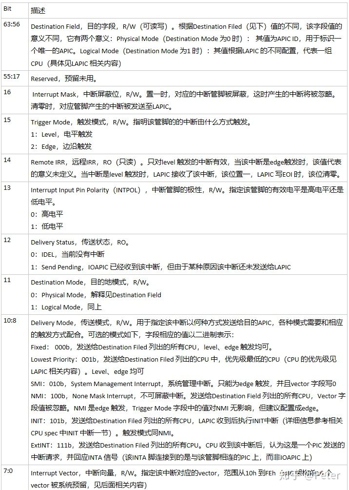

### 多核问题

#### 多核启动流程
* Bios从APs中选出BSP
* BSP先启动，在内存中记录所有的Aps（包括自己），并唤醒其他APs

#### 中断分类
1. [X86中断系统-中断源及PIC](https://blog.csdn.net/JIA_GUOQIANG/article/details/52939035)
1. 外部中断
  * 非屏蔽中断NMI（non-maskable interrupt）：总线错误、电源错误、内存错误
  * 可屏蔽中断INTR：IRQ 0~15，键盘、硬盘等设备
1. 内部中断
  * 微处理器内部中断：除法中断、溢出中断、单步中断、断点中断
  * 软件中断
  
#### 中断硬件知识
1. [畅谈“中断”](https://blog.51cto.com/alanwu/1273095)
1. 一个物理CPU可以有多个物理Core，每个Core又可以有多个硬件线程。
  * 一个物理CPU有一个总管APIC（IO APIC）：主要职责是负责中断请求的分发。
    * IO APIC可以通过软件进行配置，告诉处理器如何分发中断请求。
    * IO APIC通过设置将该中断请求提交给特定的Local APIC。
  * 每个物理Core有一个本地APIC（Local APIC）：主要职责和原来的8259A类似。
1. 消息中断MSI的作用：以前的PIC发生中断后，所有的驱动程序需要检查寄存器；有了MSI后，直接就能知道是哪个设备产生中断。
1. 解决IO中断太多的问题：
  * 硬件方案：在网卡级别对中断进行聚合，当聚合到一定程度之后再对CPU发起中断，CPU批量处理
  * 软件方案：定时轮询
1. 解决中断处理程序耗时长的问题：
  * 上半部用来快速处理中断，它在中断禁止模式下运行，主要处理跟硬件紧密相关的或时间敏感的工作
  * 下半部用来延迟处理上半部未完成的工作，通常以内核线程（ksoftirqd）的方式运行

#### LAPIC和I/O APIC
1. [X86中断/异常与APIC](https://www.cnblogs.com/wsg1100/p/14055863.html)
1. LAPIC 主要处理以下中断：
  * APIC Timer 产生的中断(APIC timer generated interrupts)
  * Performance Monitoring Counter 在 overflow 时产生的中断(Performance monitoring counter interrupts)
  * 温度传感器产生的中断(Thermal Sensor interrupts)
  * LAPIC 内部错误时产生的中断(APIC internal error interrupts)
  * 本地直连 IO 设备 (Locally connected I/O devices) 通过 LINT0 和 LINT1 引脚发来的中断
  * 其他 CPU (甚至是自己，称为 self-interrupt)发来的 IPI(Inter-processor interrupts)
  * I/O APIC 发来的中断
1. 中断向量（vector）：不论是中断还是异常，都有一个标识，称为vector number，在X86体系中中断向量范围为0-255  
1. I/O APIC转发中断给LAPIC：
  * 当I/O APIC转发的中断vector优先级小于Local APIC TPR值时，此中断不会打断该CPU上运行的task
  * 当I/O APIC转发的中断vector优先级小于Local APIC PPR值时，该CPU不处理该中断
  * 操作系统通过动态设置local APIC TPR和PPR，来实现操作系统的实时性需求和负载均衡
  * I/O APIC内部，可配置表PRT（有24个RTE，每个64bit），见[0x04: 中断信号的投递](https://www.cnblogs.com/xuanyuan/p/14679727.html)
  * I/O APIC内部，PRT的文档，见[中断配置过程](https://www.cnblogs.com/wahaha02/p/6341095.html)
1. 物理Core之间发送中断：在自己的ICR(interrupt command register)中存放对应的中断向量和目标LAPIC ID，通过线路发送到目标LAPIC：
  * system bus(Pentium 4 / Intel Xeon)
  * APIC bus(Pentium / P6 family)  

#### LAPIC和I/O APIC在xv6的配置
1. [LAPIC 和 IOAPIC](https://zhuanlan.zhihu.com/p/313725721)
1. qemu的查看命令：info pic / info ioapic / info lapic
1. I/O APIC的PRT table（Programmable Redirection Table），每个item是RTE (Redirection Table Entry)。对应的文档如下：

#### 非一致性内存访问模型（Non-Uniform Memory Access、NUMA）
1. [Redis 高负载下的中断优化](https://tech.meituan.com/2018/03/16/redis-high-concurrency-optimization.html)
1. [MYSQL数据库网卡软中断不平衡问题及解决方案](http://blog.yufeng.info/archives/2037)
1. [为什么 NUMA 会影响程序的延迟](https://draveness.me/whys-the-design-numa-performance/)
1. 早期的计算机都会使用 SMP，然而现代的多数计算机都会采用 NUMA 架构管理 CPU 和内存资源。
1. lscpu查看NUMA node，有信息显示：NUMA node0 CPU(s): 0-3, 4-7
1. 美团Redis 高负载下的中断优化：
  * 问题：所有硬中断都由Core 0处理，Core 0的处理速度跟不上收包速度
  * 解决：配置多个Core处理中断，由于美团是NUMA模型，分配时注意Core要在同一个NUMA node下（物理cpu）
1. 阿里MYSQL数据库网卡软中断不平衡问题：
  * 问题：MySQL数据库运行时，其中一个Core的软中断过多（查看命令：mpstat -P ALL 1）
  * 原因：使用的是单队列网卡，软中断时默认分配给一个Core
  * 解决1：使用多队列网卡，贵！
  * 解决2：
    * 把软中断分散到不同的Core，分配时注意Core要在同一个NUMA node下（物理cpu）
    * 由于网卡硬件亲缘性绑定，只能一个中断一个core来绑定
    * 关闭irqbalance：service irqbalance stop

